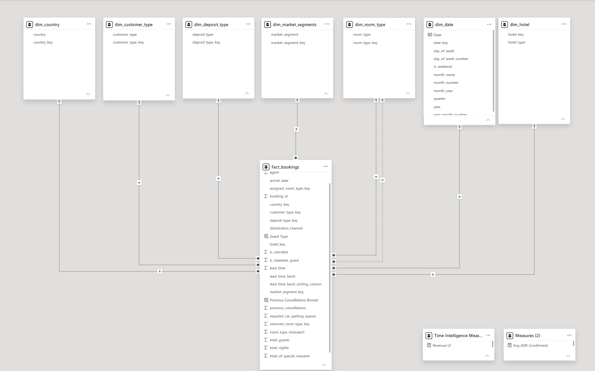

# Hotel Booking Analytics — Python, SQL \& Power BI

End-to-end analysis of \~119K hotel bookings (2015–2017, two Portuguese hotels) — from raw-data cleaning through SQL business analysis to an interactive Power BI dashboard on a proper star schema.

## 📌 Project Overview

This project analyzes the Antonio, Almeida \& Nunes hotel bookings dataset (Kaggle), covering a City Hotel and a Resort Hotel over three years. Unlike a dataset with only cosmetic data-quality issues, this one arrived with real problems worth solving: \~27% duplicate rows, negative and extreme-outlier daily rates, missing guest/agent/country values, and zero-guest bookings — all handled in a documented Python cleaning pipeline before the data ever reached SQL.

The project covers the full analytics workflow:

* **Python (pandas):** data cleaning, validation, and outlier handling
* **SQL (MySQL):** 18 business questions across 8 categories — aggregations, CTEs, manually-computed Pearson correlations, sample-size-aware filtering
* **Power BI:** a proper star schema (fact table + 7 dimension tables), DAX measures, and a 4-page interactive dashboard

**Headline finding:** this dataset has real, strong, explainable signal — a sharp contrast to a "flat" dataset with no drivers. Cancellation behavior is predictable from deposit type, lead time, and booking channel; pricing is strongly seasonal and has grown steadily year over year; and guest engagement signals (special requests, repeat-guest status) correlate meaningfully with outcomes. Full findings below.

## Table of Contents

- [Project Overview](#-project-overview)
- [Dashboard Preview](#-dashboard-preview)
- [Key Findings](#-key-findings)
- [Technologies Used](#-technologies-used)
- [Repository Structure](#-repository-structure)
- [Data Cleaning (Python)](#-data-cleaning-python)
- [Database Schema](#-database-schema-mysql)
- [SQL Business Questions \& Findings](#-sql-business-questions--findings)
- [Power BI Star Schema \& Measures](#-power-bi-star-schema--measures)
- [Author](#-author)

\---

## 📊 Dashboard Preview

**🧱 Power BI Data Model**

****

**Page 1 — Executive Overview** KPI strip (bookings, cancellation rate, revenue, avg. ADR), monthly seasonality trend by hotel, hotel-type comparison, top 10 countries by confirmed revenue.


**Page 2 — Cancellation Drivers** Deposit-type cancellation rate (the dataset's standout finding), lead-time-band cancellation gradient, market segment × channel heatmap, cancellation history, customer type.


**Page 3 — Revenue \& Pricing** ADR trend over time by hotel, ADR by room type \& hotel, revenue at risk from cancellations, lead-time/ADR correlation.


**Page 4 — Guest Behavior \& Loyalty** Repeat vs. new guest cancellation and ADR comparison, special-requests vs. cancellation trend, room-mismatch analysis, party size by segment, parking requests by customer type.


\---

## 🔑 Key Findings

**Cancellations are highly predictable — and the drivers compound.**

* **Deposit type is the single strongest predictor in the dataset**: Non-Refund bookings cancel **94.70%** of the time, vs. 26.72% (No Deposit) and 24.30% (Refundable). Investigation traced this to a narrow population — Groups booked via the TA/TO channel, disproportionately through a single travel agent — consistent with block bookings being released rather than random guest behavior.
* **Lead time predicts cancellation cleanly and monotonically**: from 7.14% for bookings made 0–3 days out, up to \~40% for bookings made 6+ months in advance.
* **Booking channel carries real risk concentration**: Online TA/TA-TO is both the single largest source of bookings (51,251 — over half the dataset) and a high-cancellation channel (35.51%).
* **Previous cancellation history shows a sharp, non-obvious spike**: guests with exactly 1 prior cancellation cancel at 76.16% — over 2.5× the rate of guests with 0 prior cancellations (26.73%) — again linked back to the same Non-Refund/Groups population.

**Pricing is strongly seasonal and has genuinely grown year over year.**

* Resort Hotel's ADR swings nearly 4× across the year ($48.60 in January to $182.10 in August); City Hotel is far flatter (\~$83–125), consistent with a summer-leisure property vs. a business/year-round property.
* Comparing the same month across years, ADR climbed every year: July $116.59 → $129.86 → $143.92 (2015→2016→2017); August $121.77 → $147.37 → $164.66 — a 24–35% increase in peak-season rate over two years.
* Lead time has **no relationship with price** (r ≈ 0.03) — booking early doesn't get a guest a better or worse rate in this dataset, a useful negative finding that rules out a common assumption.

**Guest engagement signals are real, moderate predictors — correctly scaled.**

* Row-level Pearson correlation (not aggregated group averages, which would overstate the effect): number of special requests vs. cancellation, **r ≈ -0.12**; room-type mismatch vs. cancellation, **r ≈ -0.21**. Both real, both moderate — not the inflated \~-0.97 / -0.60 an aggregated calculation would suggest.
* Repeat guests cancel far less often than new guests (\~7% vs. \~28%) but also pay noticeably less on average (\~$65 vs. \~$103 ADR) — loyalty correlates with lower risk and lower rate simultaneously.

**Revenue at risk from cancellations is substantial**: 35.23% of City Hotel's total potential revenue and 31.04% of Resort Hotel's is tied up in bookings that ultimately cancel — framed as revenue *at risk*, not revenue definitively lost, since cancelled rooms may be resold.

\---

## ⚙️ Technologies Used

* **Python** (pandas) — data cleaning and validation
* **MySQL / MySQL Workbench** — business-question SQL analysis
* **Power BI** — star-schema data model, DAX measures, interactive dashboard
* **Git \& GitHub**

\---

## 📁 Repository Structure

```
hotel\_booking\_analytics/
├── Data/          → raw hotel\_bookings.csv and cleaned dataset
├── Python/        → Jupyter notebook: data cleaning \& validation pipeline
├── SQL/           → database setup + all business-question queries
├── Power BI/      → .pbix report file (star schema + dashboard)
└── Screenshots/   → dashboard page exports

```

\---

## 🧹 Data Cleaning (Python)

- Cleaning was done in pandas before loading into SQL. Key steps:
- Renamed `adults` , `children` , `babies` to `num_adults` , `num_children` , `num_babies` for clarity
- Dropped `company` (94%+ missing)
- Filled missing `agent` (sentinel -1), `num_children` (0), and `country` (`'Unknown'`)
- Removed 32,001 duplicate rows — roughly 27% of the raw dataset, a genuinely large and unusual amount for this specific Kaggle dataset, confirmed and cross-checked directly against the raw file rather than assumed
- Filtered out negative and extreme-outlier `adr` values (raw data had a minimum of -6.38 and a maximum of 5,400 against a median of ~$95)
- Removed zero-guest bookings (`num_adults = 0 AND num_children = 0`)

**Result: 119,390 raw rows → 87,221 cleaned rows.**

🐍Full cleaning notebook: [Hotel Booking Cleaning Notebook](Python/Hotel_booking_cleaning.ipynb)

\---

## 🧱 Database Schema (MySQL)

Cleaned data was loaded into a single `hotel_bookings` table in MySQL, with derived columns added afterward:

|Derived column Formula Purpose|||
|-|-|-|
|`arrival_date`|Combined from year/month/day columns|Enables date-based trend and seasonality queries|
|`total_guests`|`num_adults + num_children + num_babies`|Party size analysis|
|`total_nights`|`stays_in_weekend_nights + stays_in_week_nights`|Length-of-stay, revenue calculations|
|`total_revenue`|`adr * total_nights`|Revenue analysis|
|`room_type_mismatch`|`1` if `reserved_room_type ≠ assigned_room_type` else `0`|Room assignment analysis|
|`lead_time_band`|Custom bins (0-3, 4-7, 8-14, 15-30, 31-60, 61-90, 91-180, 181-365, 366+)|Reused across multiple cancellation-driver queries|

🗄️Full setup script: [Hotel Booking Database_Setup](SQL/Database_Setup.sql)

\---

## 📊 SQL Business Questions \& Findings

18 business questions across 8 categories, run against the 87,221-row cleaned dataset.

### Overview

Total bookings, cancellation rate, and revenue by hotel type
```sql
WITH summary_cte AS(
	SELECT 
		hotel,
		COUNT(*) AS total_bookings_received,
		COUNT(CASE WHEN is_canceled = 0 THEN booking_id END) AS confirmed_bookings,
		COUNT(CASE WHEN is_canceled = 1 THEN booking_id END) AS cancelations,
		SUM(CASE WHEN is_canceled = 0 THEN total_revenue END) AS revenue
	FROM hotel_bookings
	GROUP BY hotel
)
SELECT 
	hotel, total_bookings_received, confirmed_bookings, cancelations,
    ROUND(100 * cancelations / total_bookings_received, 2) AS cancelation_rate,
    revenue
FROM summary_cte;
```
📌 City Hotel: 53,271 bookings, 30.10% cancellation rate, $12.15M confirmed revenue. Resort Hotel: 33,950 bookings, 23.49% cancellation rate, $10.82M confirmed revenue.
Booking volume by calendar month (seasonality, all years combined)
```sql
SELECT 
    MONTH(arrival_date) AS calendar_month,
    COUNT(booking_id) AS confirmed_bookings,
    SUM(total_revenue) AS total_revenue
FROM hotel_bookings
WHERE is_canceled = 0
GROUP BY calendar_month
ORDER BY calendar_month;
```
📌 August is the single busiest calendar month across all three years combined (7,620 confirmed bookings, $4.6M revenue), with July close behind. November–January is the trough (~3,700–3,900 bookings, under $1M revenue).
Booking and revenue trend, 2015–2017
```sql
SELECT 
    DATE_FORMAT(arrival_date, '%Y-%m') AS year_month,
    COUNT(booking_id) AS confirmed_bookings,
    SUM(total_revenue) AS total_revenue
FROM hotel_bookings
WHERE is_canceled = 0
GROUP BY year_month
ORDER BY year_month;
```
📌 August is the peak month every year (7,620 confirmed bookings, $4.6M revenue at its highest). Revenue grew faster than booking volume year over year — e.g. July 2016→2017 bookings +6.5%, revenue +18% — pointing to rate growth rather than volume growth as the main driver.
Cancellation Analysis
Cancellation rate by deposit type
```sql
SELECT 
    deposit_type,
    COUNT(*) AS total_bookings_received,
    COUNT(CASE WHEN is_canceled = 1 THEN booking_id END) AS cancelations,
    SUM(CASE WHEN is_canceled = 1 THEN total_revenue END) AS opportunity_cost,
    ROUND(100 * COUNT(CASE WHEN is_canceled = 1 THEN booking_id END) / COUNT(*), 2) AS cancelation_rate
FROM hotel_bookings
GROUP BY deposit_type;
```
📌 Non-Refund: 94.70% cancellation (982 of 1,037 bookings). No Deposit: 26.72%. Refundable: 24.30%.
Investigating the Non-Refund anomaly — market segment, channel, and agent
```sql
SELECT 
    market_segment, distribution_channel, agent,
    COUNT(booking_id) AS cancellations
FROM hotel_bookings
WHERE deposit_type = 'Non Refund' AND is_canceled = 1
GROUP BY market_segment, distribution_channel, agent
ORDER BY cancellations DESC;
```
📌 64.4% of Non-Refund cancellations come from the "Groups" market segment, 89% flow through the TA/TO channel, and a single agent accounts for nearly a third of the anomaly on its own — consistent with tour-operator block bookings being released rather than individual guest cancellations.
Cancellation rate by lead time band
```sql
SELECT 
    lead_time_band,
    COUNT(*) AS total_bookings_received,
    COUNT(CASE WHEN is_canceled = 1 THEN booking_id END) AS cancelations,
    ROUND(100 * COUNT(CASE WHEN is_canceled = 1 THEN booking_id END) / COUNT(*), 2) AS cancelation_rate
FROM hotel_bookings
GROUP BY lead_time_band
ORDER BY cancelation_rate DESC;
```
📌 Clean, monotonic gradient: 7.14% (0-3 days) → 11.39% → 20.63% → 28.29% → 31.66% → 32.58% → 35.01% → 39.69% → 40.78% (366+ days).
Cancellation rate by market segment and distribution channel (filtered to n ≥ 10 to avoid small-sample noise)
```sql
SELECT 
    market_segment, distribution_channel,
    COUNT(*) AS total_bookings_received,
    COUNT(CASE WHEN is_canceled = 1 THEN booking_id END) AS cancelations,
    ROUND(100 * COUNT(CASE WHEN is_canceled = 1 THEN booking_id END) / COUNT(*), 2) AS cancelation_rate
FROM hotel_bookings
GROUP BY market_segment, distribution_channel
HAVING total_bookings_received >= 10
ORDER BY cancelation_rate DESC;
```
📌 Online TA/TA-TO: 35.51% cancellation on 51,251 bookings — the largest volume and one of the highest risk segments simultaneously. Direct bookings are consistently the safest across every channel pairing.
Cancellation rate by previous cancellation history
```sql
SELECT 
    CASE
        WHEN previous_cancellations = 0 THEN '0'
        WHEN previous_cancellations = 1 THEN '1'
        WHEN previous_cancellations = 2 THEN '2'
        WHEN previous_cancellations = 3 THEN '3'
        WHEN previous_cancellations = 4 THEN '4'
        WHEN previous_cancellations = 5 THEN '5'
        ELSE '6+'
    END AS previous_cancellations_binned,
    COUNT(*) AS total_bookings_received,
    COUNT(CASE WHEN is_canceled = 1 THEN booking_id END) AS cancelations,
    ROUND(100 * COUNT(CASE WHEN is_canceled = 1 THEN booking_id END) / COUNT(*), 2) AS cancelation_rate
FROM hotel_bookings
GROUP BY previous_cancellations_binned
ORDER BY previous_cancellations_binned;
```
📌 Sharp, non-monotonic spike at exactly 1 prior cancellation (76.16%) — over 2.5× the 0-prior rate (26.73%) — driven partly by the same Non-Refund/Groups population found above.
Cancellation rate by customer type
```sql
SELECT 
    customer_type,
    COUNT(*) AS total_bookings_received,
    COUNT(CASE WHEN is_canceled = 1 THEN booking_id END) AS cancellations,
    ROUND(100 * COUNT(CASE WHEN is_canceled = 1 THEN booking_id END) / COUNT(*), 2) AS cancellation_rate
FROM hotel_bookings
GROUP BY customer_type
ORDER BY customer_type;
```
📌 Transient (individual) bookings — 82% of the dataset — cancel at 30.14%, by far the highest of the four customer types. Notably, this contradicts the market segment "Groups" finding above: `customer_type = Group` actually has the lowest cancellation rate (9.80%) of any customer type — these are two distinct classifications in the source data, not a contradiction in the analysis.
Revenue Analysis
Average ADR by hotel, room type, and month
```sql
SELECT 
    hotel, assigned_room_type, MONTH(arrival_date) AS arrival_month,
    AVG(CASE WHEN is_canceled = 0 THEN adr END) AS avg_adr
FROM hotel_bookings
GROUP BY hotel, assigned_room_type, arrival_month
ORDER BY avg_adr DESC;
```
📌 Room types G and F command the highest rates at both hotels; the most-booked room type (A) sits near the bottom of the pricing scale. Resort Hotel's pricing swings nearly 4× seasonally ($48.60 January → $182.10 August); City Hotel is far flatter (~$83–125 year-round).
Revenue at risk from cancellations
```sql
SELECT 
    hotel,
    SUM(total_revenue) AS total_potential_revenue,
    SUM(CASE WHEN is_canceled = 1 THEN total_revenue END) AS revenue_at_risk_from_cancellations,
    ROUND(100 * SUM(CASE WHEN is_canceled = 1 THEN total_revenue END) / SUM(total_revenue), 2) AS cancelled_percent
FROM hotel_bookings
GROUP BY hotel;
```
📌 City Hotel: 35.23% of potential revenue at risk ($6.61M). Resort Hotel: 31.04% ($4.87M). Framed as revenue at risk, not revenue definitively lost, since cancelled rooms may be resold to another guest.
Does lead time correlate with ADR?
```sql
SELECT 
    (AVG(lead_time * adr) - AVG(lead_time) * AVG(adr)) /
    (STDDEV_POP(lead_time) * STDDEV_POP(adr)) AS correlation_coefficient
FROM hotel_bookings
WHERE is_canceled = 0;
```
📌 r ≈ 0.028 — no meaningful relationship. Booking further in advance doesn't predict a higher or lower rate in this dataset.
ADR trend over time
```sql
SELECT 
    DATE_FORMAT(arrival_date, '%Y-%m') AS year_month,
    ROUND(AVG(CASE WHEN is_canceled = 0 THEN adr END), 2) AS avg_adr
FROM hotel_bookings
GROUP BY year_month
ORDER BY year_month;
```
📌 Comparing the same month year over year, ADR rose consistently: July $116.59 → $129.86 → $143.92; August $121.77 → $147.37 → $164.66 — roughly 24–35% growth in peak-season rate over two years.
Guest Geography
Top 10 countries by booking volume and cancellation rate
```sql
SELECT 
    country,
    COUNT(*) AS total_bookings_received,
    COUNT(CASE WHEN is_canceled = 0 THEN booking_id END) AS confirmed_bookings,
    COUNT(CASE WHEN is_canceled = 1 THEN booking_id END) AS cancellations,
    ROUND(100 * COUNT(CASE WHEN is_canceled = 1 THEN booking_id END) / COUNT(*), 2) AS cancellation_rate
FROM hotel_bookings
GROUP BY country
ORDER BY total_bookings_received DESC, cancellation_rate DESC
LIMIT 10;
```
Party size by market segment (filtered to n ≥ 10)
```sql
SELECT 
    market_segment,
    CASE
        WHEN total_guests BETWEEN 1 AND 5 THEN '1-5'
        WHEN total_guests BETWEEN 6 AND 15 THEN '6-15'
        WHEN total_guests BETWEEN 16 AND 30 THEN '16-30'
        ELSE '31+'
    END AS party_size,
    COUNT(*) AS total_bookings_received,
    COUNT(CASE WHEN is_canceled = 0 THEN booking_id END) AS confirmed_bookings,
    ROUND(100 * COUNT(CASE WHEN is_canceled = 0 THEN booking_id END) / COUNT(*), 2) AS confirmation_rate
FROM hotel_bookings
GROUP BY market_segment, party_size
HAVING total_bookings_received >= 10
ORDER BY confirmation_rate DESC;
```
Top countries by confirmed revenue
```sql
SELECT 
    country,
    SUM(CASE WHEN is_canceled = 0 THEN total_revenue END) AS total_confirmed_revenue
FROM hotel_bookings
GROUP BY country
ORDER BY total_confirmed_revenue DESC
LIMIT 10;
```
Stay Patterns & Room Assignment
Average length of stay by hotel and market segment
```sql
SELECT 
    hotel, market_segment,
    ROUND(IFNULL(AVG(CASE WHEN is_canceled = 0 THEN total_nights END), 0), 2) AS avg_length_of_stay
FROM hotel_bookings
GROUP BY hotel, market_segment;
```
Room type mismatch rate and its relationship to cancellation
```sql
SELECT 
    COUNT(*) AS total_bookings_received,
    COUNT(CASE WHEN room_type_mismatch = 1 THEN booking_id END) AS bookings_with_room_mismatch,
    ROUND(100 * COUNT(CASE WHEN room_type_mismatch = 1 THEN booking_id END) / COUNT(*), 2) AS room_mismatch_rate,
    COUNT(CASE WHEN is_canceled = 1 THEN booking_id END) AS cancellations,
    ROUND(100 * COUNT(CASE WHEN is_canceled = 1 THEN booking_id END) / COUNT(*), 2) AS cancellation_rate
FROM hotel_bookings;

-- Row-level Pearson correlation
SELECT 
    (AVG(room_type_mismatch * is_canceled) - AVG(room_type_mismatch) * AVG(is_canceled)) /
    (STDDEV_POP(room_type_mismatch) * STDDEV_POP(is_canceled)) AS correlation_coefficient
FROM hotel_bookings;
```
📌 r ≈ -0.21 (moderate negative, computed at the row level — an earlier version aggregated by date first, which inflated the coefficient to -0.60). Mismatches associate with lower cancellation; one plausible explanation is hotels resolving mismatches via complimentary upgrades for guests who show up, rather than downgrades.
Repeat Guests & Loyalty
Cancellation rate: repeat vs. new guests
```sql
SELECT 
    CASE WHEN is_repeated_guest = 1 THEN 'repeat_guests' ELSE 'new_guests' END AS guest_type,
    COUNT(*) AS total_bookings_received,
    COUNT(CASE WHEN is_canceled = 1 THEN booking_id END) AS cancellations,
    ROUND(100 * COUNT(CASE WHEN is_canceled = 1 THEN booking_id END) / COUNT(*), 2) AS cancellation_rate
FROM hotel_bookings
GROUP BY guest_type;
```
📌 Repeat guests cancel significantly less often than new guests.
ADR and booking changes: repeat vs. new guests
```sql
SELECT 
    CASE WHEN is_repeated_guest = 1 THEN 'repeat_guests' ELSE 'new_guests' END AS guest_type,
    ROUND(IFNULL(AVG(CASE WHEN is_canceled = 0 THEN adr END), 0), 2) AS avg_adr
FROM hotel_bookings
GROUP BY guest_type;
```
📌 New guests pay nearly 50% more on average than repeat guests.
Booking changes: repeat vs. new guests
```sql
SELECT 
    CASE WHEN is_repeated_guest = 1 THEN 'repeat_guests' ELSE 'new_guests' END AS guest_type,
    ROUND(IFNULL(AVG(CASE WHEN is_canceled = 0 THEN booking_changes END), 0), 2) AS avg_booking_changes
FROM hotel_bookings
GROUP BY guest_type;
```
📌 Interestingly, average booking changes remain roughly equal between repeat and new guests — loyalty affects cancellation rate and price paid, but not how often a guest amends their booking.
Do special requests correlate with lower cancellation?
```sql
SELECT 
    total_of_special_requests,
    COUNT(*) AS total_bookings_received,
    COUNT(CASE WHEN is_canceled = 1 THEN booking_id END) AS cancellations,
    ROUND(100 * COUNT(CASE WHEN is_canceled = 1 THEN booking_id END) / COUNT(*), 2) AS cancellation_rate
FROM hotel_bookings
GROUP BY total_of_special_requests
ORDER BY cancellation_rate;

-- Row-level Pearson correlation
SELECT 
    (AVG(total_of_special_requests * is_canceled) - AVG(total_of_special_requests) * AVG(is_canceled)) /
    (STDDEV_POP(total_of_special_requests) * STDDEV_POP(is_canceled)) AS correlation_coefficient
FROM hotel_bookings;
```
📌 r ≈ -0.12 (weak-to-moderate negative, row-level — an earlier version aggregated across only 6 grouped values, which inflated the coefficient to -0.97). Direction holds: more special requests associates with lower cancellation, consistent with an "engaged guest" theory, though the true effect is moderate, not near-perfect.
Car parking requests by customer type
```sql
SELECT 
    customer_type,
    ROUND(AVG(required_car_parking_spaces), 2) AS avg_parking_space_required
FROM hotel_bookings
GROUP BY customer_type;
```

🗄️Full query set:[SQL Scripts](SQL/Queries.sql)

\---

## 📈 Power BI Star Schema \& Measures

The cleaned data was modeled as a proper star schema in Power BI rather than reported directly off the flat table:

**Fact table:** `fact\_bookings` — booking-level measures (lead time, ADR, revenue, guest counts, cancellation flag, etc.) plus foreign keys to each dimension.

**Dimension tables:** `dim\_date` (a full continuous calendar, marked as the model's official date table for time-intelligence support), `dim\_hotel`, `dim\_market\_segment`, `dim\_deposit\_type`, `dim\_customer\_type`, `dim\_room\_type` (a role-playing dimension, linked to both `reserved\_room\_type` and `assigned\_room\_type`, with the assigned-room relationship active by default), `dim\_country`.

**Core DAX measures:**

```dax
Total Bookings = COUNTROWS(fact_bookings)
Confirmed Bookings = CALCULATE([Total Bookings], fact_bookings[is_canceled] = 0)
Cancellations = CALCULATE([Total Bookings], fact_bookings[is_canceled] = 1)
Cancellation Rate = DIVIDE([Cancellations], [Total Bookings])
Total Potential Revenue = SUM(fact_bookings[total_revenue])
Confirmed Revenue = CALCULATE([Total Potential Revenue], fact_bookings[is_canceled] = 0)
Revenue at Risk = CALCULATE([Total Potential Revenue], fact_bookings[is_canceled] = 1)
Avg ADR (Confirmed) = CALCULATE(AVERAGE(fact_bookings[adr]), fact_bookings[is_canceled] = 0)

```

Correlation measures (special requests, room mismatch, lead time vs. ADR) were rebuilt in DAX using the same manual Pearson formula as the SQL layer (`STDEVX.P` in place of MySQL's `STDDEV_POP`), so the dashboard's correlation callouts match the corrected, row-level SQL results exactly.

📊Full report file: [Power BI](Power BI/Hotel_booking_report.pbix)

\---

## 👤 Author

**Abiskar Shiwakoti**

Data Analyst (entry-level) | Python | SQL | Power BI

\---

## ⭐ Project Purpose

Built as a flagship portfolio project to demonstrate the full analytics workflow end to end: real-world data cleaning (not a pre-cleaned dataset), business-question-driven SQL analysis with genuine investigative follow-ups (tracing the Non-Refund anomaly back to its source), statistically careful correlation work (catching and correcting an aggregation-bias error before it reached the dashboard), and a properly normalized Power BI star schema rather than a flat single-table report.

